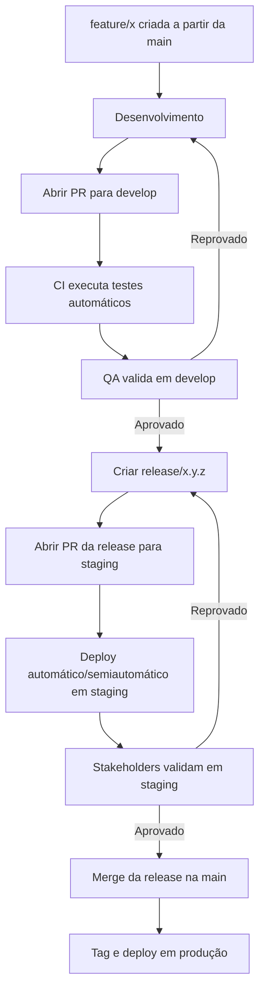
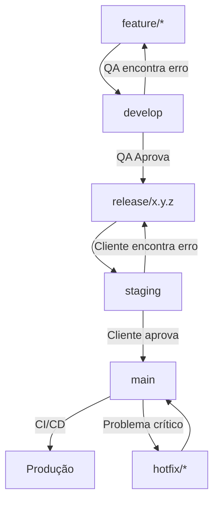

# Padrão de Fluxo de Git

## Objetivo do Documento

Definir um fluxo único, previsível e simples para uso do Git em todos os repositórios da equipe, garantindo:

- Organização do histórico
- Redução de conflitos
- Padronização das branches
- Previsibilidade no processo de entrega (CI/CD)
- Segurança nas releases de produção

---

## Princípios Gerais

1. Trabalhar sempre em branches, nunca diretamente na main.
2. Cada feature = uma branch isolada.
3. Pull Requests obrigatórios para qualquer mudança.
4. Commits claros e padronizados (usando [Conventional Commits](https://www.conventionalcommits.org/pt-br/v1.0.0/)).
5. CI rodando automaticamente para toda PR.
6. Merges sempre via PR, nunca com push --force.

---

## Estrutura Oficial de Branches

### Branches permanentes

| Branch  | Função                                |
| ------- | ------------------------------------- |
| main    | Código em produção.                   |
| develop | Usada para validação do time de QA    |
| stagind | Usada para validação dos stakeholders |

### Branches temporárias (ciclo de desenvolvimento)

| Tipo    | Nome                    | Uso                                |
| ------- | ----------------------- | ---------------------------------- |
| Feature | feature/nome-da-feature | Desenvolvimento de funcionalidades |
| Fix     | fix/nome-do-fix         | Correções pequenas e rápidas       |
| Hotfix  | hotfix/nome-do-fix      | Correções críticas em Produção     |
| Release | release-x.y.z           | Preparação de uma versão estável   |

---

## Convenções de nomes para branches

Sempre minúsculas, contendo o tipo e descrição curta:

- feature/cadastro-usuarios
- fix/erro-ao-gerar-relatorio
- hotfix/corrigir-certificados-prod
- release/1.3.0

---

## Convenção de commits

### Formato do commit

Sempre minúsculas, contendo tipo, escopo e descrição curta:

`tipo(escopo): descrição curta`

### Tipos de commits permitidos

- `feat`: nova funcionalidade
- `fix`: correção
- `chore`: manutenção
- `docs`: documentação
- `test`: testes
- `refactor`: refatorações
- `perf`: melhorias de performance

**Exemplos**

```bash
feat(auth): adicionar fluxo de recuperação de senha
fix(reports): corrigir cálculo de carga horária
docs(adr): criar ADR de versionamento de API
```

---

## Processo de desenvolvimento

### 1. Criar uma branch a partir da main

```bash
git checkout main
git pull
git checkout -b feature/nome
```

### 2. Desenvolver e commitar seguindo o padrão

```bash
git add .
git commit -m "feat(monitoria): permitir inscrição de monitores"
```

### 3. Abrir Pull Request (PR) para a develop

- Abrir PR assim que houver código funcional (PR precoce = menos conflito)
- CI roda automaticamente
- Deploy automático no ambiente QA
- QA valida a funcionalidade

#### Quando QA encontra erro em develop

Existem dois casos:

##### Caso 1 - PR ainda está aberto

Basta ajustar na própria branch feature:

```
git checkout feature/nome
git commit -m "fix(escopo): ajuste solicitado pelo QA"
git push
```

O PR atualiza automaticamente e o QA retesta.

##### Caso 2 — PR já foi mergeado em develop

Nesse caso:

- Volte para a branch feature
- Atualize com a main
- Commit e push
- Abra novo PR → develop

```
git checkout feature/nome
git pull origin main
git commit -m "fix(escopo): corrigir erro encontrado pelo QA"
git push
```

Importante

- Nunca se cria uma branch fix/ para corrigir bugs de QA nessa fase.
- Nada vai para staging até a aprovação total do QA.

---

### 4. Fluxo de Release

**Como acontece:**



Após a aprovação do QA, criar branch release

`git checkout -b release/1.2.0`

A branch release deve conter somente correções finais, nunca novas features.

### 5. Enviar Release para staging

**Como acontece:**



- Criar PR da `release` para `staging`
- Deploy automático no ambiente de homologação
- Stakeholders validam

#### Quando o cliente encontra erro em staging

- Corrigir na branch release

```
git checkout release/1.2.0
git pull
git commit -m "fix(staging): corrigir erro validado pelo cliente"
git push
```

- Re-executar deploy em staging

**Desta forma:**

- staging continua limpo
- develop não precisa tocar
- main não muda até a aprovação
- não recria release desnecessariamente

Se o erro for complexo, pode criar uma branch auxiliar:

`fix/release-1.2.0-erros-staging`

Depois merge nessa release.

### 6. Após aprovação dos stakeholders - merge da Release na main

- Abrir PR para a `main`
- Deploy automático em Produção.

### Hotfix em Produção (main)

Quando surge um problema crítico na main:

```bash
git checkout main
git pull
git checkout -b hotfix/correcao-y
```

Após ajuste:

- PR → develop
- PR → staging
- PR → main

Isso mantém todos os ambientes sincronizados.

#### Deploy por ambiente

| Branch  | Ambiente    | Deploy           |
| ------- | ----------- | ---------------- |
| develop | QA          | Automático       |
| staging | Homologação | Automático       |
| main    | Produção    | Automático + Tag |

### Tags e versionamento

Usar **SemVer**:

`MAJOR.MINOR.PATCH`

Exemplos:

- 1.0.0 — primeira versão
- 1.1.0 — nova funcionalidade
- 1.1.1 — correção pequena

Criar tag manual, se necessário:

```bash
git tag -a 1.1.1 -m "Correção do módulo de X"
git push origin 1.1.1
```

---

## Boas Práticas

- Commits pequenos e frequentes.
- PRs pequenas (ideal < 300 linhas).
- Nunca misturar feature com refatoração pesada.
- Nunca trabalhar diretamente na branch dos outros.
- Branch sempre atualizada com main antes de abrir PR.

---

## Anti-Patterns (o que evitar)

- `git push --force` na main.
- PR gigante com 30 arquivos alterados.
- Commits genéricos como “ajustes”.
- Branch sem nomeação clara.
- Commits diretamente na main.

---

**Changelog**

| Versão | Data       | Alteração                 | Autor                                               |
| ------ | ---------- | ------------------------- | --------------------------------------------------- |
| 1.0    | 2025-12-11 | Criação inicial da página | [Anderson Vieira](https://linkedin.com/in/vieira-a) |

```

```
